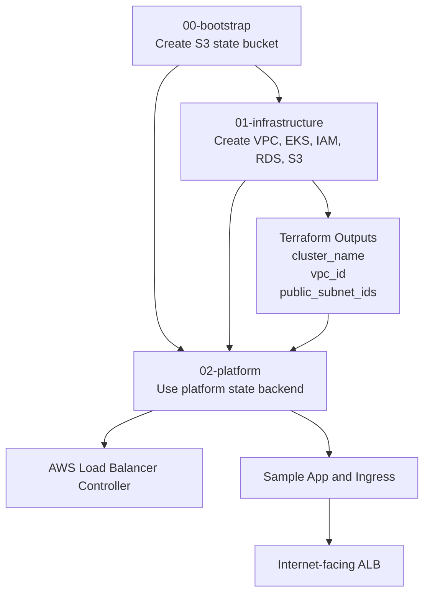
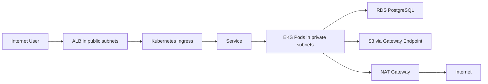

# AWS EKS HA Infrastructure với Terraform

Repository này dựng kiến trúc được mô tả trong sơ đồ, gồm:

- một VPC trải trên 2 Availability Zones
- 2 public subnets và 2 private subnets
- Internet Gateway
- 1 NAT Gateway cho mỗi Availability Zone
- Amazon EKS control plane và managed node group chạy trên cả 2 private subnets
- AWS Load Balancer Controller để tạo internet-facing ALB từ Kubernetes Ingress
- Amazon RDS for PostgreSQL ở chế độ Multi-AZ
- private Amazon S3 bucket và S3 Gateway VPC Endpoint
- EKS Pod Identity cho AWS Load Balancer Controller và application service account
- Terraform remote state trên S3 với S3-native lock files

## Tách stack

```text
00-bootstrap      Tạo S3 bucket chứa Terraform state.
01-infrastructure Tạo network, EKS, RDS, S3, IAM và security resources trên AWS.
02-platform       Cài AWS Load Balancer Controller và tùy chọn tạo workload mẫu với ALB.
```

Việc tách riêng stack `02-platform` giúp tránh lỗi bootstrap giữa provider `kubernetes` / `helm` và EKS API khi cluster còn chưa sẵn sàng.

## Tài liệu chi tiết theo stack

- `00-bootstrap`: [00-bootstrap/README.md](00-bootstrap/README.md)
- `01-infrastructure`: [01-infrastructure/README.md](01-infrastructure/README.md)
- `02-platform`: [02-platform/README.md](02-platform/README.md)

## Luồng phụ thuộc



## Luồng runtime



## Vị trí cấu hình Helm của AWS Load Balancer Controller

File values template nằm tại:

```text
02-platform/helm-values/aws-load-balancer-controller-values.yaml.tftpl
```

Terraform sẽ render file template này với `cluster_name`, `aws_region`, `vpc_id` và `replica_count` trước khi truyền vào `helm_release`.

## Điều kiện cần

- Terraform 1.15.x
- AWS CLI v2
- AWS profile hoặc IAM role đã xác thực
- `kubectl` để kiểm tra sau khi apply
- IAM permissions đủ để tạo VPC, EKS, EC2, IAM, RDS, S3, KMS, CloudWatch và Elastic Load Balancing resources

Không nên lưu AWS access key hoặc database password trong `.tfvars`. Mật khẩu master của RDS trong repo này được AWS Secrets Manager quản lý.

## 1. Bootstrap remote state bucket

```bash
cd 00-bootstrap
cp terraform.tfvars.example terraform.tfvars
terraform init
terraform fmt -check
terraform validate
terraform plan -out bootstrap.tfplan
terraform apply bootstrap.tfplan
terraform output -raw state_bucket_name
```

Lấy output bucket này và điền vào cả 2 file `backend.hcl`, đồng thời điền vào `terraform.tfvars` của `02-platform` nếu cần.

## 2. Tạo hạ tầng AWS

```bash
cd ../01-infrastructure
cp backend.hcl.example backend.hcl
cp terraform.tfvars.example terraform.tfvars
```

Thay `cluster_public_access_cidrs` bằng public IP của máy hoặc CI runner sẽ chạy stack `02-platform`:

```hcl
cluster_public_access_cidrs = ["YOUR.PUBLIC.IP.ADDRESS/32"]
```

Sau đó chạy:

```bash
terraform init -backend-config=backend.hcl
terraform fmt -check
terraform validate
terraform plan -out infrastructure.tfplan
terraform apply infrastructure.tfplan
```

Cấu hình `kubectl`:

```bash
aws eks update-kubeconfig \
  --region ap-southeast-1 \
  --name "$(terraform output -raw cluster_name)"

kubectl get nodes -o wide
```

## 3. Cài platform add-on và tạo ALB

```bash
cd ../02-platform
cp backend.hcl.example backend.hcl
cp terraform.tfvars.example terraform.tfvars
terraform init -backend-config=backend.hcl
terraform fmt -check
terraform validate
terraform plan -out platform.tfplan
terraform apply platform.tfplan
```

Kiểm tra:

```bash
kubectl get deployment -n kube-system aws-load-balancer-controller
kubectl get pods -n app -o wide
kubectl get ingress -n app
terraform output sample_alb_hostname
```

## Luồng traffic

```text
Internet
  -> Internet Gateway
  -> ALB in both public subnets
  -> Kubernetes Ingress / Service
  -> EKS Pods in private subnets
  -> RDS PostgreSQL endpoint on TCP 5432

EKS Pods
  -> S3 Gateway VPC Endpoint
  -> private S3 bucket

EKS nodes and pods requiring internet egress
  -> NAT Gateway in the same Availability Zone
  -> Internet Gateway
  -> Internet
```

## Các thay đổi nên làm trước khi go-live

- Đặt `db_deletion_protection = true`.
- Đặt `db_skip_final_snapshot = false`.
- Thay listener HTTP mẫu bằng HTTPS dùng ACM bằng cách set `certificate_arn`.
- Chạy Terraform từ CI role được kiểm soát và giới hạn EKS public endpoint chỉ cho runner đó, hoặc tắt public endpoint và chạy từ bên trong VPC.
- Tách private subnet cho application và database nếu baseline bảo mật yêu cầu DB tier riêng.
- Bổ sung Route 53, AWS WAF, CloudWatch alarms, GuardDuty, CloudTrail, VPC Flow Logs, AWS Backup và tích hợp application secrets.
- Rà lại IAM policy của Load Balancer Controller và giới hạn theo VPC hoặc cluster tags khi phù hợp.
- Rà lại chi phí hàng tháng trước khi apply. Hai NAT Gateways, EKS, từ hai EC2 node trở lên và Multi-AZ RDS đều phát sinh chi phí liên tục.

## Thứ tự destroy

Destroy `02-platform` trước để controller kịp xóa ALB và target groups:

```bash
cd 02-platform
terraform destroy

cd ../01-infrastructure
terraform destroy
```

Bucket state ở `00-bootstrap` có `prevent_destroy = true`, nên nếu không còn cần dùng nữa thì phải xử lý có chủ đích, bao gồm dọn object trước khi xóa.
